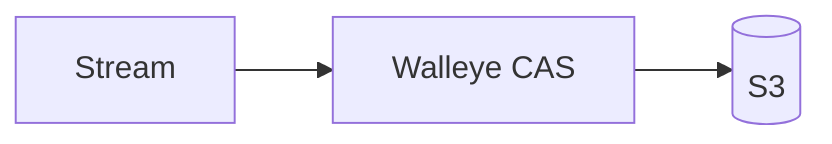
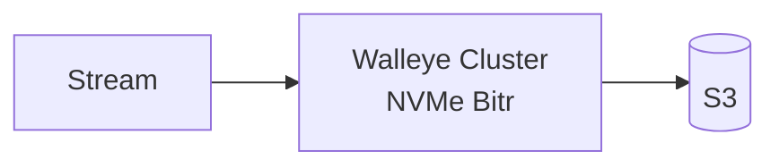

# Walleye

A LanceDB server with a write-ahead log on S3. Connect with the stock
`lancedb` SDK, point the server at a bucket, and every write is durable in
object storage before it is acknowledged. Reads are served from a local
NVMe and RAM cache ([Foyer](https://github.com/foyer-rs/foyer)).

Each table is its own memshard: an independent writer, WAL sequence, and
manifest, so tables ingest in parallel with no shared lock. Rows are keyed by
a content hash unless the schema marks a primary key, so a retried insert
lands once.

## Quickstart

Build it, give it a bucket, run it.

```sh
cargo build --release -p walleye-node

export AWS_ACCESS_KEY_ID=...
export AWS_SECRET_ACCESS_KEY=...
export AWS_REGION=us-east-1        # or "auto" for Tigris, R2, etc.
# export AWS_ENDPOINT=https://...  # only for non-AWS S3

WALLEYE_BUCKET=my-bucket WALLEYE_TOKEN=change-me-to-a-long-secret ./target/release/walleye-node
```

Then use LanceDB as usual. Any `lancedb` SDK works: pass the node as
`host_override` and the token as `api_key`.

```python
import lancedb

db = lancedb.connect("db://walleye", api_key="change-me-to-a-long-secret",
                     host_override="http://localhost:8080", region="local")

tbl = db.create_table("clicks", data=[
    {"id": 1, "city": "seattle",  "vector": [0.0, 1.0]},
    {"id": 2, "city": "seattle",  "vector": [1.0, 0.0]},
    {"id": 3, "city": "portland", "vector": [0.0, -1.0]},
])
tbl.add([{"id": 4, "city": "boise", "vector": [-1.0, 0.0]}])

tbl.count_rows("city = 'seattle'")                       # 2
tbl.search().where("id > 1").select(["id", "city"]).to_list()
tbl.search([0.0, 0.9]).limit(2).to_list()                # nearest first, with _distance
tbl.search([0.0, 0.9]).where("city = 'portland'").to_list()
```

That's the whole config. Leave `WALLEYE_TOKEN` unset and the node generates one
and prints it on startup. Everything else has a default:

| Variable | Default | Meaning |
| --- | --- | --- |
| `WALLEYE_BUCKET` | required | Bucket, or `bucket/prefix` |
| `WALLEYE_PORT` | `8080` | HTTP listen port |
| `WALLEYE_TOKEN` | generated | API key, at least 16 chars |
| `WALLEYE_RAM_GB` | `1` | In-memory cache size |
| `WALLEYE_NVME_GB` | `8` | On-disk cache size |
| `WALLEYE_DIR` | `./walleye-cache` | On-disk cache path |
| `WALLEYE_MEMBERS` | none | Cluster members as `id=http://host:8080,...` |
| `WALLEYE_NODE_ID` | `single` | This node's id; required with `WALLEYE_MEMBERS` |
| `WALLEYE_BITR_URL` | none | Bitr gateway; setting it enables cluster mode |
| `WALLEYE_TRACE_ORIGIN` | unset | Log every request that reaches object storage |

`WALLEYE_ROOT_URI` accepts a full `s3://` or `file://` URI in place of
`WALLEYE_BUCKET`. `WALLEYE_CONFIG` points at a JSON file for deployments that
need the full config struct.

Prefer Docker? `docker build -t walleye .` produces an image whose default
command is `walleye-node`. Pass the same `WALLEYE_*` and `AWS_*` variables
through. `integration/compose.yaml` runs a full local stack against MinIO, and
`integration/lancedb_acceptance.py` drives a node with the Python SDK.

## What works

The server speaks the LanceDB remote protocol, so the SDK's `connect`,
`create_table`, `open_table`, `list_tables`, `drop_table`, `add`,
`count_rows`, `create_index`, `list_indices`, and `search` with `where`,
`select`, `limit`, `offset`, and vector queries all work unchanged.

**Vector indexes.** Every vector column is indexed from the first row: an HNSW
graph over the memtable, flushed as an IVF_HNSW_SQ index on each generation,
and rebuilt when generations are compacted. There is no separate training
step. `create_index` sets the metric (`l2`, `cosine`, `dot`) and rewrites the
flushed generations before it returns, so queries never see a stale index.
Queries use the index's metric; asking for a different one is an error.

**Compaction.** Flushed generations are merged in the background once eight
exist, keeping the newest row per key and rebuilding the indexes, so query
fan-out stays bounded. `POST /v1/table/{name}/compact_lsm/` runs one now,
`flush_lsm/` forces a flush, and `get_lsm_stats/` lists generations with row
counts and index names.

Not yet: full-text search, `update`, `delete`, `merge_insert`, and namespaces.
Each returns a 400 with a plain reason.

**Primary keys.** Mark a field with the Lance metadata
`lance-schema:unenforced-primary-key = "true"` on your Arrow schema to use it as
the key. Otherwise Walleye adds a hidden content-hash key: identical rows
collapse to one, so a retried insert is a no-op and every memshard stays
idempotent.

**SQL.** `POST /v1/query` with `{"sql": "..."}` and `Authorization: Bearer
<token>` runs DataFusion SQL across every table. This is a Walleye extension;
LanceDB has no SQL endpoint.

## Architecture

**Single node: S3 CAS.** The default. Every write is appended to a WAL in S3
with conditional puts before the SDK gets its acknowledgement. No coordination service, no local
durability, one process.



**Cluster: Bitr.** Set `WALLEYE_BITR_URL` and `WALLEYE_MEMBERS`. Writes are
acknowledged once two of three replicas have them on NVMe, then archived to
S3. See `deploy/kubernetes` for the manifests.



**Any node, any request.** Every member serves the full API. Each stream is
owned by one member, chosen by rendezvous hashing the stream name over the
membership ring, and only the owner holds its MemWAL writer. A request that
reaches a non-owner is forwarded to the owner, so clients need no knowledge
of the topology and never see a 503. Reads go through the owner too, so they
always include the memtable. SQL that spans tables with different owners is
refused with a 400 rather than answered from a partial view.

**Fencing.** A new owner claims the next MemWAL writer epoch through a
manifest CAS; the previous owner's WAL appends and manifest commits fail from
that point. In Bitr mode the Bitr writer epoch is minted from the same claim,
so the replicas fence a stale owner as well. Forwarded requests carry the
sender's membership fingerprint and are refused with a 409 if the receiver
sees a different membership, and a forwarded request that lands on a
non-owner is refused instead of forwarded again.

## Crates

| Crate | Responsibility |
| --- | --- |
| `walleye-node` | Stream HTTP API, durable definitions, authentication, peer service |
| `walleye-lance` | WAL adapter, memshards, stable snapshots, read-only SQL |
| `walleye-cache` | Lance cache backend over Foyer, object blocks, peer envelopes, query resources |
| `walleye-bitr` | Encrypted records, quorum client, commit certificates, recovery |
| `walleye-bitr-server` | Replica logs, coordinator, archival, placement, fencing |
| `walleye-ring` | Weighted rendezvous ownership and bounded previous-owner handoff |
| `walleye-workload` | Executable S3 and Docker acceptance workload |
