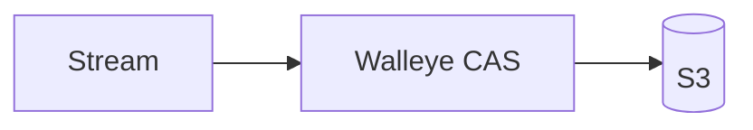
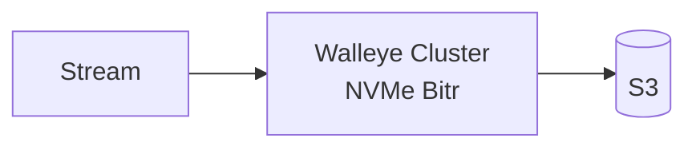

# Walleye

WAL over S3 (LanceDB). Define a stream, ingest rows, query it with SQL.

Each stream owns its own memshard, writer lock, WAL sequence, and S3 manifest.
Different streams ingest concurrently in both S3 CAS and Bitr modes.

## Quickstart

Build it, give it a bucket, run it.

```sh
cargo build --release -p walleye-node

export AWS_ACCESS_KEY_ID=...
export AWS_SECRET_ACCESS_KEY=...
export AWS_REGION=us-east-1        # or "auto" for Tigris, R2, etc.
# export AWS_ENDPOINT=https://...  # only for non-AWS S3

WALLEYE_BUCKET=my-bucket WALLEYE_TOKEN=change-me-to-a-long-secret ./target/release/walleye-node
```

That's the whole config. Leave `WALLEYE_TOKEN` unset and the node generates one
and prints it on startup. Everything else has a default:

| Variable | Default | Meaning |
| --- | --- | --- |
| `WALLEYE_BUCKET` | required | Bucket, or `bucket/prefix` |
| `WALLEYE_PORT` | `8080` | HTTP listen port |
| `WALLEYE_TOKEN` | generated | Bearer token, at least 16 chars |
| `WALLEYE_RAM_GB` | `1` | In-memory cache size |
| `WALLEYE_NVME_GB` | `8` | On-disk cache size |
| `WALLEYE_DIR` | `./walleye-cache` | On-disk cache path |
| `WALLEYE_MEMBERS` | none | Cluster members as `id=http://host:8080,...` |
| `WALLEYE_NODE_ID` | `single` | This node's id; required with `WALLEYE_MEMBERS` |
| `WALLEYE_BITR_URL` | none | Bitr gateway; setting it enables cluster mode |

`WALLEYE_ROOT_URI` accepts a full `s3://` or `file://` URI in place of
`WALLEYE_BUCKET`. `WALLEYE_CONFIG` points at a JSON file for deployments that
need the full config struct.

Then define a stream, ingest, and query.

```sh
TOKEN=change-me-to-a-long-secret

# 1. Define a stream.
curl http://localhost:8080/v1/streams \
  -H "Authorization: Bearer $TOKEN" \
  -H 'Content-Type: application/json' \
  -d '{"name":"clicks","columns":[{"name":"id","type":"int64"},{"name":"city","type":"string"},{"name":"value","type":"float64"}],"primary_key":["id"]}'

# 2. Ingest.
curl http://localhost:8080/v1/streams/clicks/events \
  -H "Authorization: Bearer $TOKEN" \
  -H 'Content-Type: application/json' \
  -d '{"rows":[{"id":1,"city":"Seattle","value":2.5},{"id":2,"city":"Seattle","value":4.0}]}'

# 3. Query.
curl http://localhost:8080/v1/query \
  -H "Authorization: Bearer $TOKEN" \
  -H 'Content-Type: application/json' \
  -d '{"sql":"SELECT city, count(*) AS n, sum(value) AS total FROM clicks GROUP BY city"}'
# [{"city":"Seattle","n":2,"total":6.5}]
```

Prefer Docker? `docker build -t walleye .` produces an image whose default
command is `walleye-node`. Pass the same `WALLEYE_*` and `AWS_*` variables
through. `integration/compose.yaml` runs a full local stack against MinIO.

## Architecture

**Single node: S3 CAS.** The default. Every write commits straight to S3 with
conditional puts. No coordination service, no local
durability, one process.



**Cluster: Bitr.** Set `WALLEYE_BITR_URL` and `WALLEYE_MEMBERS`. Writes are
acknowledged once two of three replicas have them on NVMe, then
archived to S3. See `deploy/kubernetes` for the manifests.



## Crates

| Crate | Responsibility |
| --- | --- |
| `walleye-node` | Stream HTTP API, durable definitions, authentication, peer service |
| `walleye-lance` | WAL adapter, memshards, stable snapshots, read-only SQL |
| `walleye-cache` | Lance cache backend over Foyer, object blocks, peer envelopes, query resources |
| `walleye-bitr` | Encrypted records, quorum client, commit certificates, recovery |
| `walleye-bitr-server` | Replica logs, coordinator, archival, placement, fencing |
| `walleye-ring` | Weighted rendezvous ownership and bounded previous-owner handoff |
| `walleye-workload` | Executable S3 and Docker acceptance workload |
