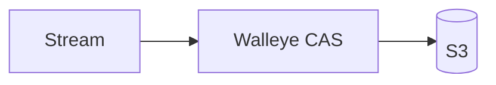
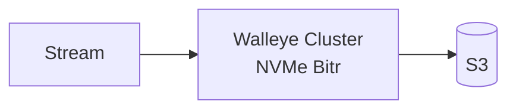

# Walleye

WAL over S3 (LanceDB). Define a stream, ingest rows, query it with SQL.

Each stream owns its own memshard, writer lock, WAL sequence, and S3 manifest.
Different streams ingest concurrently in both S3 CAS and Bitr modes.

## Quickstart

Build the node, point it at an S3 prefix, start it.

```sh
cargo build --release -p walleye-node
```

Write a config. `token` must be at least 16 characters. `directory` is the local
cache path, and `api.root_uri` is where everything durable lives.

```sh
mkdir -p /tmp/walleye
cat > /tmp/walleye/config.json <<'JSON'
{
  "node_id": "single",
  "listen": "0.0.0.0:8080",
  "directory": "/tmp/walleye/cache",
  "memory_bytes": 134217728,
  "disk_bytes": 536870912,
  "bitr": false,
  "members": [{"id": "single", "endpoint": "http://localhost:8080", "weight": 1.0}],
  "token": "change-me-to-a-long-secret",
  "api": {"root_uri": "s3://my-bucket/walleye"}
}
JSON
```

Give it S3 credentials and run it. The standard `AWS_*` variables are read
directly. Add `AWS_ENDPOINT` and `AWS_ALLOW_HTTP=true` for MinIO or other
S3-compatible stores.

```sh
export AWS_ACCESS_KEY_ID=...
export AWS_SECRET_ACCESS_KEY=...
export AWS_REGION=us-east-1
WALLEYE_CONFIG=/tmp/walleye/config.json ./target/release/walleye-node
```

Then define a stream, ingest, and query.

```sh
TOKEN=change-me-to-a-long-secret

# 1. Define a stream.
curl http://localhost:8080/v1/streams \
  -H "Authorization: Bearer $TOKEN" \
  -H 'Content-Type: application/json' \
  -d '{"name":"clicks","columns":[{"name":"id","type":"int64"},{"name":"city","type":"string"},{"name":"value","type":"float64"}],"primary_key":["id"]}'

# 2. Ingest.
curl http://localhost:8080/v1/streams/clicks/events \
  -H "Authorization: Bearer $TOKEN" \
  -H 'Content-Type: application/json' \
  -d '{"rows":[{"id":1,"city":"Seattle","value":2.5},{"id":2,"city":"Seattle","value":4.0}]}'

# 3. Query.
curl http://localhost:8080/v1/query \
  -H "Authorization: Bearer $TOKEN" \
  -H 'Content-Type: application/json' \
  -d '{"sql":"SELECT city, count(*) AS n, sum(value) AS total FROM clicks GROUP BY city"}'
# [{"city":"Seattle","n":2,"total":6.5}]
```

Prefer Docker? `docker build -t walleye .` produces an image whose default
command is `walleye-node`. Mount your config at `/etc/walleye/config.json` and
pass the `AWS_*` variables through. `integration/compose.yaml` runs a full
local stack against MinIO.

## Architecture

**Single node: S3 CAS.** Omit `api.bitr_url` and set `bitr: false`. Every write
commits straight to S3 with conditional puts. No coordination service, no local
durability, one process.



**Cluster: Bitr.** Set `api.bitr_url` to the Bitr gateway and `bitr: true`.
Writes are acknowledged once two of three replicas have them on NVMe, then
archived to S3. See `deploy/kubernetes` for the manifests.



## Crates

| Crate | Responsibility |
| --- | --- |
| `walleye-node` | Stream HTTP API, durable definitions, authentication, peer service |
| `walleye-lance` | WAL adapter, memshards, stable snapshots, read-only SQL |
| `walleye-cache` | Lance cache backend over Foyer, object blocks, peer envelopes, query resources |
| `walleye-bitr` | Encrypted records, quorum client, commit certificates, recovery |
| `walleye-bitr-server` | Replica logs, coordinator, archival, placement, fencing |
| `walleye-ring` | Weighted rendezvous ownership and bounded previous-owner handoff |
| `walleye-workload` | Executable S3 and Docker acceptance workload |
