# GitHub App execution design

Status: intended hosted architecture. The CLI acceptance workflow exists; the
GitHub App, queue, whole-job sandbox, native project test runner, and publication
service are not implemented. QuickJS function isolation is not a whole-job sandbox.

The App coordinates jobs; a disposable worker runs declank against an immutable
checkout of one repository commit. Each job records repository/installation
identity, commit SHA, tool and policy versions, objective, issue limit, dollar
limit, and a unique job ID. Queue retries must reconcile existing attempts and
model usage before dispatching more calls, so a retry cannot reset spending.

```mermaid
flowchart LR
  App[GitHub App] --> Queue[Job: commit, objective, issues, dollars]
  Queue --> Worker[Disposable worker]
  Worker --> Scan[Scan and build source packets]
  Scan --> Tests[Freeze tests and reproduce]
  Tests --> Patch[Candidate patch]
  Patch --> Gates[Tests, quality measurements, independent review]
  Gates -->|reject: budget remains| Patch
  Gates --> Evidence[Patch, logs, scores, acceptance record]
  Evidence --> Publisher[App checks commit and publishes result]
```

The worker gets a read-only baseline and a separate writable candidate workspace.
The outer container or VM enforces process, wall-time, memory, disk, and network
limits. Repository code and dependencies must run there, without host mounts,
host process access, a Docker socket, or GitHub publication credentials. Dependency
fetching needs a separate constrained step; test execution should not inherit
its credentials. Model requests and dollar accounting belong to a trusted broker
outside repository code. Full project test execution must not inherit that
broker's API credentials either.

The agent receives indexed source, callers/callees, contracts, and test context
for one objective. It returns structured tests, patches, or critiques; the trusted
coordinator executes validation. Candidate and baseline run the same frozen
regressions plus the project's configured checks. Full project checks are a
future extension: the current CLI explicitly reports only isolated function
verification and must not advertise project integration success.

Each attempt produces immutable artifacts: source hashes, diff, frozen test hash,
execution results, before/after metrics, graph coverage, independent review, and
usage ledger. A fix is eligible only when correctness and maintainability gates
both pass. Unresolved behavior, failed checks, rejected readability, exhausted
budget, or incomplete execution remains visible and earns no fix credit.

The publisher runs outside the untrusted worker. It validates the job identity,
base commit, artifact integrity, required checks, and current acceptance policy
before creating an App check or a proposed change. Hosted artifacts need trusted
storage or an attestation; the CLI's local hashes detect changes but are not a
cryptographic signature from a trusted worker. Changes to the repository head
invalidate the candidate until it is revalidated. Score changes remain previews
until the merged commit is rescanned. Automatic merging is a separate product
policy, not part of running a scan.

Background scheduling does not require Batch inference. Test, patch, and review
stages depend on each other's results; independent jobs at the same stage can be
batched later. The current backends are synchronous API calls or Codex login,
and the worker queue and Batch transport remain future work.
